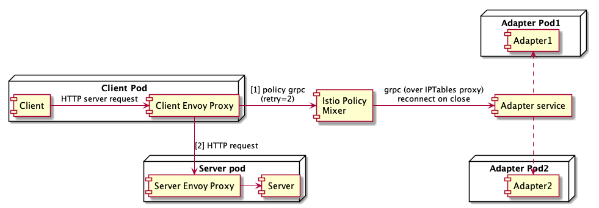
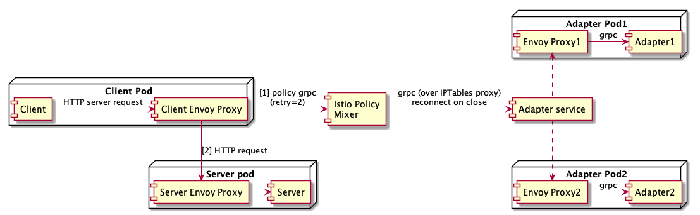
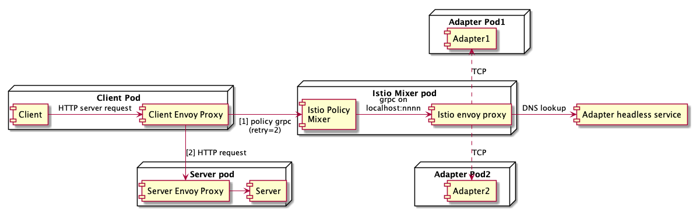
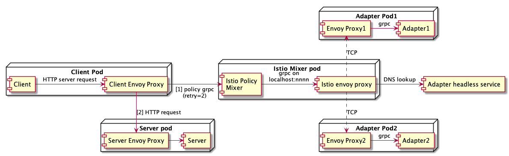

chaos-adapter
---

An out of process istio policy adapter to simulate various failure conditions to see what happens.

It exposes a "hello world" GRPC service on port 4080 and a corresponding HTTP service on 8080. [main.go](main.go)

The HTTP service supports the following endpoints:

* `POST /grpc/stop` - stop the GRPC service but keep the container alive
* `POST /grpc/start` - restart the GRPC service
* `POST /grpc/delay/:delay` - add a delay (e.g. `5s`) to GRPC responses
* `GET /status` - status page for liveness probe
* `GET /metrics` - metrics for prometheus

* The [adapter client](cmd/frontend/main.go) is the client to the [adapter service](cmd/backend/main.go). All inbound
requests to the adapter service are configured to run the "policy checks" done by the adapter.

Failure scenarios
---

### Adapter pod is running but gRPC service is not listening.

This is the scenario with extended outages. An adapter pod that advertises itself to be healthy but cannot be connected to.

We found that this scenario only recovers in the following cases:

* no envoy proxies in the middle (mixer directly connects to adapter gRPC endpoint)
* mixer using a client envoy proxy **with outlier detection turned on** and adapter is out of the mesh.
* once the adapter is in the mesh, clients never see a closed connection and keep retrying requests to the same pod.

### Pod redeployment

This is the mini version of the same scenario as above. 

* grpc server stops (outage starts)
* http service stops (envoy proxy still listening)
* envoy proxy shutdown, if adapter in mesh (after all other listeners have stopped)
* containers deleted, end of outage

### Long delay in adapter response, causing client timeouts.

* Client times out 
* Mixer times out but maintains existing connection to downstream
* Error forever for all requests

If one of the adapter pods were to go into a degraded state, connections to that pod will all fail until it is killed.

Deployment
---

For tests that involve a client envoy proxy from mixer to adapter, create a static mixer config with `localhost:15300` 
forwarding traffic to `chaos-adapter-headless.${NAMESPACE}:4080`. Once this is done, the static config is either used 
or not based on how you define the handler endpoint.

`make deploy` emits YAML based on environment variables and can be piped into `kubectl apply -f -`. It creates a
`rule` object in the `istio-system` namespace and all other objects in a `chaos` namespace (by default, you can
override the `NAMESPACE` env var).

### Setup #1

No envoy proxies in mixer path.

```
PROXY_INBOUND_PORTS=8080 make deploy
```



### Setup #2

Adapter in mesh no client proxy.

```
make deploy
```



### Setup #3

Adapter out of mesh, with client proxy.

```
PROXY_INBOUND_PORTS=8080 HANDLER_ENDPOINT=localhost:15300 make deploy
```



### Setup #4

Adapter in mesh, with client proxy.

```
HANDLER_ENDPOINT=localhost:15300 make deploy
```



Testing methodology
---

Create objects using the correct variant of the `make deploy` command and wait for things to settle.

In one window, see what happens with mixer logs:

```
kubectl logs -f -n istio-system -l app=policy --max-log-requests 20 -c mixer | grep -v -e ^gc -e ^sc
```

In another window, introduce chaos in one of the pods:

```
kubectl exec chaos-adapter-pod-name  -c adapter -- curl -s -X POST localhost:8080/grpc/stop
```
